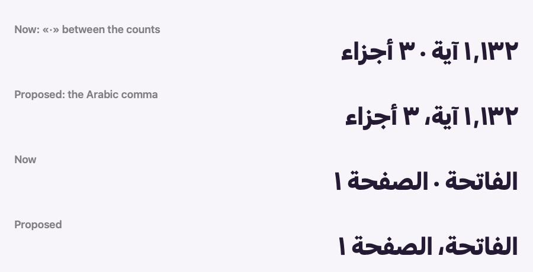
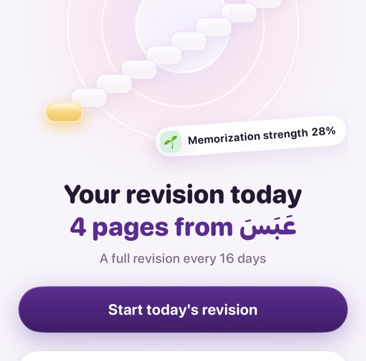
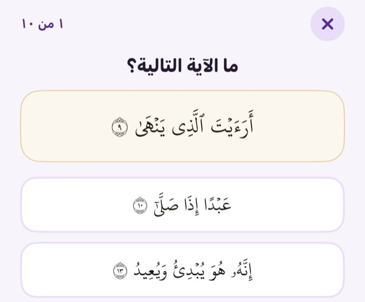
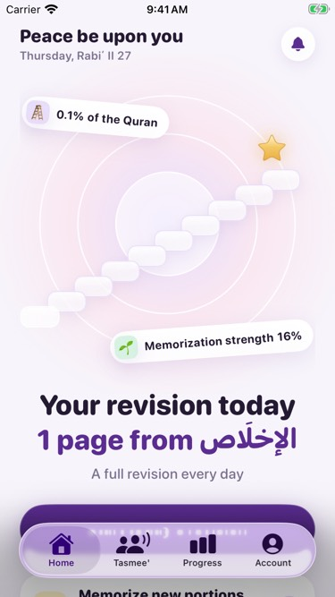

# QA proposals — October 2026

Changes found during the QA pass ([QA-LOG.md](QA-LOG.md)) that weren't built, because they're visual or design
changes, new features, or change the product's behavior or the SRS algorithm. Each one waits for your review;
nothing here is in the code. They're ordered by priority. Each has the problem, what I propose, and, where it helps,
a screenshot or mock (in [docs/qa](qa)).

| # | Pri | Proposal | Area |
|---|---|---|---|
| 1 | P2 | Use the Arabic comma instead of «·» between Arabic counts | Typography |
| 2 | P2 | Support Dynamic Type on iOS | Accessibility |
| 3 | P2 | Don't give the stage test's answer away with ayah numbers | Stage test |
| 4 | P2 | Fit the home's first screen on small iPhones | Layout |
| 5 | P3 | VoiceOver in revision: don't read the veiled ayat | Accessibility |
| 6 | P3 | Raise the contrast of the soft grey text | Accessibility, color |
| 7 | P3 | List every upcoming booking, and date the cancellation message | Tasmee' |
| 8 | P3 | Choose between bidding and the free seat in the UI | Auction |
| 9 | P3 | Don't offer auctioned seats on a session less than 3 hours away | Sessions |
| 10 | P3 | Count a stage test closed midway as taken | Stage test |
| 11 | P3 | Keep the home's stage steady through the day | Home |
| 12 | P3 | An undo for unmarking an ayah in marking mode | Mushaf |
| 13 | P3 | Ask the daily amount after marking in the Mushaf | Setup |
| 14 | P3 | Skip the daily reminder once the wird is done | Notifications |
| 15 | P3 | Let an anonymous student delete their backup | Account |
| 16 | P3 | Android: fix the string import's renaming, then catch up with iOS | Android |

---

## 1. Use the Arabic comma instead of «·» between Arabic counts (P2)

**Problem.** The app separates facts with a middle dot «·» in about 27 places. In Arabic the middle dot is drawn
exactly like the Arabic-Indic zero «٠», so next to a number it changes the number. The home's "Edit what you've
memorized" row, «١٬١٣٢ آية · ٣ أجزاء», reads as "1,132 ayat, **30** juz'". The same happens on the Mushaf's
top bar («الجزء ٣٠ · الصفحة ٥٨٢»), the plan line, the session lines and the tasmee' history.

**Proposal.** In Arabic, separate with the Arabic comma «،» (or, where a list reads oddly, a thin vertical bar «|»
with spaces). Keep «·» in English. One helper, used by every one of the 27 places, would make the choice. VoiceOver
no longer reads the standalone dots aloud ([QA-LOG](QA-LOG.md) #14).

## 2. Support Dynamic Type on iOS (P2)

**Problem.** Every text in the iOS app has a fixed size (`.system(size:)`, 342 places), so the system's text-size
setting changes nothing, even at the largest accessibility sizes (screenshot: the largest size, unchanged). Many
huffaz are elderly (SRS §2.3). The Android app already scales (it sizes text in `sp`). SRS ATT-08 is 🟡.

**Proposal.** Introduce a small set of type tokens (title, headline, body, caption…) built on text styles
(`Font.system(.title, design: .rounded).weight(.heavy)`, or `size` with `relativeTo:`), and move the screens to
them. To protect the composed stages (the stairs, the floating chips), cap the root at
`.dynamicTypeSize(...DynamicTypeSize.accessibility2)` and let cards and rows wrap instead of truncating. The Mushaf
keeps its page-exact layout; its reading size is the page's own (pinch-to-zoom could come later). I'd suggest doing
it screen by screen with a before/after for your review.

## 3. Don't give the stage test's answer away with ayah numbers (P2)

**Problem.** In "Which ayah comes next?", the question shows ayah 9 with its end-of-ayah number «٩», and each option
shows its own number. The right option is the one numbered «١٠», so the question can be answered without knowing
the ayat by heart.

**Proposal.** Show the options without their end-of-ayah markers: the words exactly as published, only the
trailing marker glyph left out. This touches how sacred text is shown, so it's your call (CON-01): the text isn't
changed, but part of it isn't drawn. I'd recommend hiding the markers in the options only, and keeping the
question's ayah whole. (Keeping every number and choosing distractors with nearby numbers wouldn't help: the right
one would still be the next number.)

## 4. Fit the home's first screen on small iPhones (P2)

**Problem.** On an iPhone SE (667 pt tall) the home's glowing stage takes 360 pt, so the main button, "Start
today's revision", sits under the tab bar on first sight; the student has to scroll to find what to do today.

**Proposal.** Scale the stage down on short screens (about 260–280 pt when the screen is under 700 pt tall), so the
headline and the button are on the first screen. Larger iPhones are unchanged.

## 5. VoiceOver in revision: don't read the veiled ayat (P3)

**Problem.** VoiceOver reads each Mushaf page as its plain text (UI-05). During a revision the page is still read
whole, veiled ayat included, so a VoiceOver user hears what they're meant to recite from memory, and the page offers
no way to reveal the next ayah or mark a stumble except the bar's buttons.

**Proposal.** In a revision, read only the revealed ayat, and give the page accessibility actions: "Reveal the next
ayah", and "Mark a stumble" on each revealed ayah.

## 6. Raise the contrast of the soft grey text (P3)

**Problem.** The secondary text color (`inkSoft`, #7B7290) on white is about 4.3:1; the accessibility audit flags
most 11–13 pt details as "nearly passed" (WCAG AA asks 4.5:1 for small text).

**Proposal.** Darken it slightly, to about #6C6383 (≈5:1), across the app's own screens. It's a palette change, so
it's yours to approve.

## 7. List every upcoming booking, and date the cancellation message (P3)

**Problem.** The Tasmee' tab shows only the next booking. When a teacher cancels a later one, the student learns of
it only from the inbox, whose message, "Sheikh X cancelled a session you were in", doesn't say which.

**Proposal.** Show all upcoming bookings in the Tasmee' tab (the first one large, the rest as rows), and have the
inbox message name the session's day and time (the app can look it up from the booking it holds).

## 8. Choose between bidding and the free seat in the UI (P3)

**Problem.** A student can hold a bid for an auctioned seat and also book a free seat in the same session. The
server now lets the bid go at settlement instead of charging twice ([QA-LOG](QA-LOG.md) #10), but the UI still
offers both side by side.

**Proposal.** Once a student holds a free seat, hide the auction strip ("You have a seat"); while they hold a bid,
the free seat's button says "Book a free seat instead" and booking releases the bid (a server call).

## 9. Don't offer auctioned seats on a session less than 3 hours away (P3)

**Problem.** Bidding closes 3 hours before a session, but the session editor offers auctioned seats for any start
time; a session starting in 2 hours is created with its bidding already closed.

**Proposal.** Disable "Seats by auction" (with a one-line reason) when the start is less than 3 hours away.

## 10. Count a stage test closed midway as taken (P3)

**Problem.** Closing the stage test with ✕ records nothing, so a student can start over until the questions suit
them; only a finished test starts the 24-hour cooldown (MAS-03).

**Proposal.** Once the first answer is given, closing records the test as taken (the unanswered questions wrong).

## 11. Keep the home's stage steady through the day (P3)

**Problem.** The stage card follows today's portion while it's due. Once it's memorized (or on a rest day) it falls
back to the most recently memorized or declared ayah, so it can jump: re-marking al-Fatiha moved it from stage 10 to
stage 1 for the rest of the day.

**Proposal.** With a plan, the current stage is the one holding the next portion whatever today's state (CUR-02);
without one, the most recently memorized in Aqra, not merely declared.

## 12. An undo for unmarking an ayah in marking mode (P3)

**Problem.** In marking mode a tap on a memorized ayah unmarks it, and its record goes with it: strength, revision
history, the teacher's verified mark. Tapping it again starts it fresh. A stray tap loses months of history.

**Proposal.** A small "Undo" in the marking bar for a few seconds after unmarking (or keep unmarked records for the
session, restored if re-marked).

## 13. Ask the daily amount after marking in the Mushaf (P3)

**Problem.** In «ماذا تحفظ؟», "Mark pages and ayat in the Mushaf" goes straight to the Mushaf and skips the daily
revision amount and the plan; those students never see them (the suggestion is used silently).

**Proposal.** After the first "Done" in that marking, show the daily amount page (and the plan's offer), as the
other path does.

## 14. Skip the daily reminder once the wird is done (P3)

**Problem.** The daily reminder says "Your pages for today are waiting for you" even when today's wird is already
done.

**Proposal.** When the day's wird is completed, remove today's pending reminder and schedule from tomorrow (the
reminder is a repeating local notification today; it would become a rolling set of dated ones).

## 15. Let an anonymous student delete their backup (P3)

**Problem.** Every install backs up to an anonymous account from day one (ACC-01), but "Delete account" appears
only after signing in, so an anonymous student can't delete what was backed up.

**Proposal.** Offer "Delete my backup" in Account for anonymous students too (the same deletion, without the
sign-in step).

## 16. Android: fix the string import's renaming, then catch up with iOS (P3)

**Problem.** Running `tools/import-ios-strings.py` today would rename existing Android resources: a new iOS key
("a week" as «في الأسبوع») takes the name `a_week`, and the old «أسبوع» becomes `a_week_2`, so existing screens
would silently show the wrong text. The Android strings are also behind the catalog (keys added on iOS since
4b787f6), and the plan setup's one-question-per-page redesign (b11fd17, f041690) isn't ported (known).

**Proposal.** Make the import keep existing names (read the current XML first; give new keys new names), then
regenerate, then port the plan editor.
